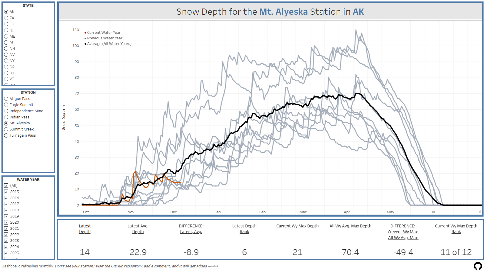

# Snow Depth Dashboard

A data pipeline and visualization system for tracking snow depth across multiple weather stations in the United States. Aggregates data from four public sources into Google BigQuery for analysis in Tableau.



## Data Sources

| Source | Coverage | Type | Historical |
|--------|----------|------|------------|
| **NRCS SNOTEL** | Western US | Automated sensors | 10+ years |
| **NOAA CDO (GHCND)** | Nationwide | NWS Cooperative stations | 10+ years |
| **California CDEC** | California | State snow sensors | 10+ years |
| **SnoCountry** | US Ski Resorts | Resort-reported | Daily only |

## Architecture

```
┌─────────────────────────────────────────────────────────────┐
│                    Google Apps Script                        │
│  ┌───────────┐ ┌───────────┐ ┌───────────┐ ┌─────────────┐  │
│  │  SNOTEL   │ │  NWS HYD  │ │   CDEC    │ │ SnoCountry  │  │
│  └─────┬─────┘ └─────┬─────┘ └─────┬─────┘ └──────┬──────┘  │
│        │             │             │              │          │
│        └─────────────┴──────┬──────┴──────────────┘          │
│                             │                                │
│                    ┌────────▼────────┐                       │
│                    │ BigQueryUtils   │                       │
│                    └────────┬────────┘                       │
└─────────────────────────────┼───────────────────────────────┘
                              │
                    ┌─────────▼─────────┐
                    │  Google BigQuery  │
                    │  snow_data.       │
                    │  observations     │
                    └─────────┬─────────┘
                              │
                    ┌─────────▼─────────┐
                    │     Tableau       │
                    │    Dashboard      │
                    └───────────────────┘
```

## Setup

### Prerequisites
- Google Cloud Platform account with BigQuery enabled
- Google Sheets (for station configuration)
- NOAA CDO API token ([request here](https://www.ncdc.noaa.gov/cdo-web/token))
- Tableau Desktop or Tableau Public

### 1. BigQuery Setup

Create dataset and table:

```sql
CREATE SCHEMA snow_data;

CREATE TABLE snow_data.observations (
  date DATE,
  station STRING,
  station_id STRING,
  state STRING,
  snow_depth_in INTEGER,
  water_year INTEGER,
  day_of_wy INTEGER,
  month STRING,
  month_num INTEGER,
  is_current_wy BOOL,
  last_updated TIMESTAMP,
  source STRING,
  month_rank INTEGER
);
```

### 2. Apps Script Setup

1. Create a new Google Sheet
2. Go to **Extensions → Apps Script**
3. Add each `.gs` file from the `apps-script/` folder
4. Add BigQuery service: **Services → BigQuery API → Add**
5. Update `BigQueryUtils.gs` with your project ID
6. Store your NOAA CDO token in **Project Settings → Script Properties**:
   - Property: `NOAA_CDO_TOKEN`
   - Value: `your-token-here`

### 3. Initial Data Load

Run in order:
1. `setupSheets()` — creates Stations configuration sheet
2. `setupNWSStations()` — adds NWS stations
3. `setupCDECStations()` — adds CDEC stations
4. `fetchAllStationsData()` — loads SNOTEL historical data
5. `fetchNWSHistoricalData()` — loads NWS historical data
6. `fetchCDECHistoricalData()` — loads CDEC historical data
7. `fetchSnoCountryData()` — loads current resort data

### 4. Daily Updates

Run `createMasterDailyTrigger()` to schedule automatic updates at 6 AM daily.

### 5. Tableau Connection

1. **Connect → Google BigQuery**
2. Select project → `snow_data` → `observations`
3. Create visualization with:
   - Columns: `Month` (sorted by `Month Num`)
   - Rows: `Water Year`
   - Color: `Year Color` calculated field
   - Detail: `Snow Depth In`

## File Descriptions

### apps-script/

| File | Purpose |
|------|---------|
| `SNOTEL_Snow_Depth_Data.gs` | Fetches data from NRCS SNOTEL stations |
| `NWS_HYD_NOAA_CDO.gs` | Fetches data from NOAA CDO API and NWS HYD products |
| `AdditionalSnowSources.gs` | Fetches data from CDEC and SnoCountry |
| `DailyUpdateController.gs` | Orchestrates all daily updates |
| `BigQueryUtils.gs` | Writes data to BigQuery |

### bigquery/

| File | Purpose |
|------|---------|
| `schema.sql` | Table creation and utility queries |

## Tableau Calculated Fields

**Year Color** (for highlighting current year):
```
IF [Water Year] = {MAX([Water Year])} THEN "red" ELSE "gray" END
```

**Rank Tooltip**:
```
"Rank: " + STR(MAX([Month Rank])) + " of " + STR({FIXED [Station], [Month] : COUNTD([Water Year])})
```

## Station Configuration

Stations are managed in the Google Sheet "Stations" tab:

| Column | Description |
|--------|-------------|
| Station_Name | Display name |
| Station_ID | Source-specific ID |
| State | State code |
| Source | NRCS, NWS, CDEC, or SNOCOUNTRY |
| Elevation_Ft | Station elevation |
| HYD_Site | NWS office code (NWS only) |
| HYD_Search | Search term in HYD report (NWS only) |
| Active | TRUE/FALSE to enable/disable |

## Updating Month Rank

After loading new data, recalculate ranks:

```sql
ALTER TABLE snow_data.observations DROP COLUMN month_rank;

CREATE OR REPLACE TABLE snow_data.observations AS
SELECT o.*,
  r.month_rank
FROM snow_data.observations o
JOIN (
  SELECT station, month_num, water_year,
    RANK() OVER (PARTITION BY station, month_num ORDER BY SUM(snow_depth_in) DESC) AS month_rank
  FROM snow_data.observations
  GROUP BY station, month_num, water_year
) r
ON o.station = r.station 
  AND o.month_num = r.month_num 
  AND o.water_year = r.water_year;
```

## License

MIT

## Acknowledgments

- [NRCS SNOTEL](https://www.nrcs.usda.gov/wps/portal/wcc/home/snowClimateMonitoring/snowpack/)
- [NOAA Climate Data Online](https://www.ncei.noaa.gov/cdo-web/)
- [California CDEC](https://cdec.water.ca.gov/)
- [SnoCountry](https://feeds.snocountry.net/)
